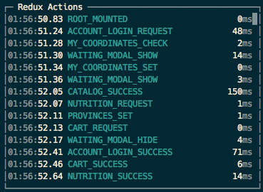
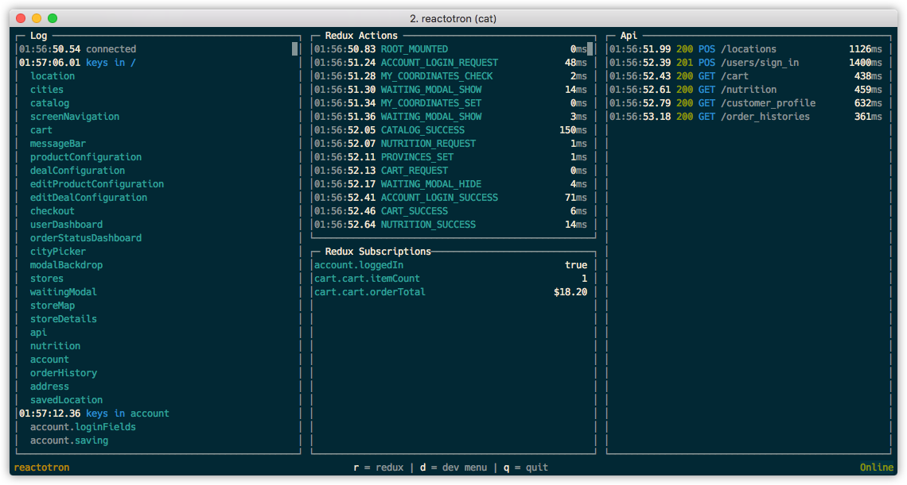

# Reactotron

[](https://www.npmjs.org/package/reactotron)

Control, monitor, and instrument your React DOM and React Native apps.  From the comfort of your TTY.


### Platforms Supported

* React Native 0.23+
* React DOM 15+
* [React Native Web](https://github.com/necolas/react-native-web) 0.0.15+

### Great For

* sending logging commands as text or objects
* relaying all redbox errors and yellowbox warnings
* watching the flow of actions as they get dispatched
* tracking performance of each action watching for hotspots
* querying your global state like a database
* subscribing to values in your state and be notified when they change
* dispatching your custom actions
* watching your HTTP calls to servers and track timing

# Requirements

* Node 4.x+
* Abnormal love for all things console


# Installing

`npm install reactotron --save-dev`


# Running The Server

`node_modules/.bin/reactotron`

Might be worth creating an alias or adding it to your script section of your `package.json`.

# How To Use

Remember, this is a development tool.  It'll help you build your app.  But you don't want to ship
your product with this left on.  :)

To use this, you need to add a few lines of code to your app.

Depending on how much support you'd like, there's a few different places you'll want to hook in.

### Entry Point (required)

##### Provides:

* sending logging commands as text or objects
* relaying all redbox errors and yellowbox warnings


##### How To Hook:

If you have `index.ios.js` or `index.android.js`, you can place this code somewhere near the top:

```js
import Reactotron from 'reactotron'

Reactotron.connect()
```

### Redux Middleware (optional)



##### Great For:

* watching the flow of actions as they get dispatched
* tracking performance of each action watching for hotspots

##### Hook To Hook:

```js
// wherever you create your Redux store, add the Reactotron middleware:
import Reactotron from 'reactotron'

const store = createStore(
  rootReducer,
  applyMiddleware(
    logger,
    Reactotron.reduxMiddleware // <--- here i am!
  )
)

```

### Redux Store (optional)


##### Great For:

* querying your global state like a database
* subscribing to values in your state and be notified when they change
* dispatching your custom actions


##### How To Hook:

```js
// wherever you create your Redux store
import Reactotron from 'reactotron'

const store = createStore(...)  // however you create your store
Reactotron.addReduxStore(store) // <--- here i am!
```

### API Tracking (optional)


##### Great For:

* watching your HTTP calls to servers and track timing
* currently supports [apisauce](https://github.com/skellock/apisauce)

##### How To Hook:

```js
// wherever you create your API
import Reactotron from 'reactotron'

// with your existing api object, add a monitor
api.addMonitor(Reactotron.apiLog)
```

# Tips

##### Using With Android

If you're using an Android sim and it's running 5.x or higher, you can use `adb` to port forward
the right TCP port to the `reactotron` server.

`$ANDROID_HOME/platform-tools/adb reverse tcp:3334 tcp:3334`

##### Using On A Device

When you initialize the `reactotron` you can tell it the server location when you connect:

`Reactotron.connect('10.0.1.109')`

##### Useful shortcuts

You can clear your reactotron by hitting backspace/delete OR you can insert a separator by pressing the "-" key.

For some commands, like dispatching an action, you can repeat previous by pressing the "." key.

# Next Steps

A couple things are highest priority on my plate:

* refactor the client to be modular
* support a `.reactotron` project-specific directory for plugins and stuff
* documentation on how to create and extend

This project is a week old, so there's some rough edges.  I'm already using this on my project and hopefully you can too!


# Getting Involved

PRs and bug reports are welcome!

You want to start extending this?

* fork it
* `npm install`
* run the server with `npm start`
* to develop the client: `cd client && npm install`

`npm link` doesn't work well because symlinks and React Native don't play well.  `watchman` doesn't like them.


# Wishlist

* [ ] Get the vocab right (current everything is a "command")
* [ ] Refactor clients to organize commands
* [ ] Allow commands to be extended on client & server
* [ ] Allow a .reactotron sub-folder for project-specific things
* [ ] Does router need to exist anymore?
* [ ] Api size metrics
* [ ] Pages for logging
* [ ] Show what the profile shows
* [ ] Track saga effect chains
* [ ] Provide a way to drive the navigator
* [ ] Allow simple scripts to be written that send commands
* [ ] Strategy for dealing with multiple apps connecting

# Random Pics





# Special Thanks

A shout out to my teammates at [Infinite Red](https://infinite.red) who encourage this type of open-source hacking & sharing.  

[](https://infinite.red)

Also, to [Kevin VanGelder](https://github.com/kevinvangelder),
who spawned the idea for this library by saying, "Hey, you know what would
be cool? A REPL. We should do that."

# Change Log

##### April 21, 2016 - 0.2.0

* Supports React DOM
* Supports React Native Web - thx @necolas

##### April 20, 2016 - 0.1.0

* Initial release
