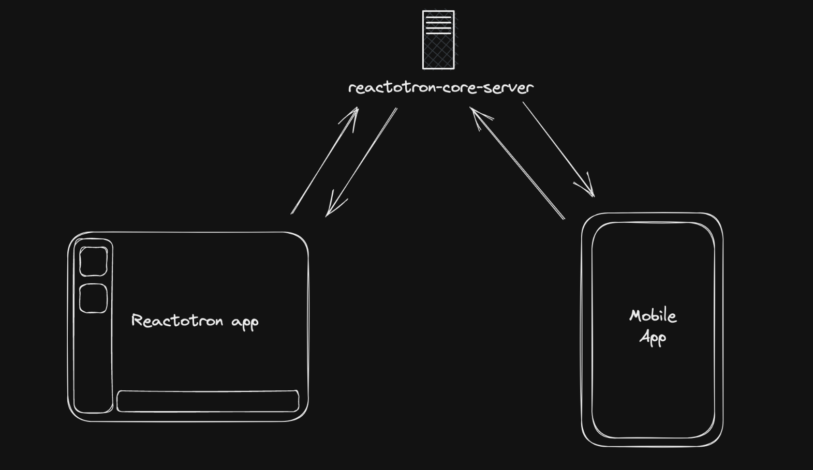
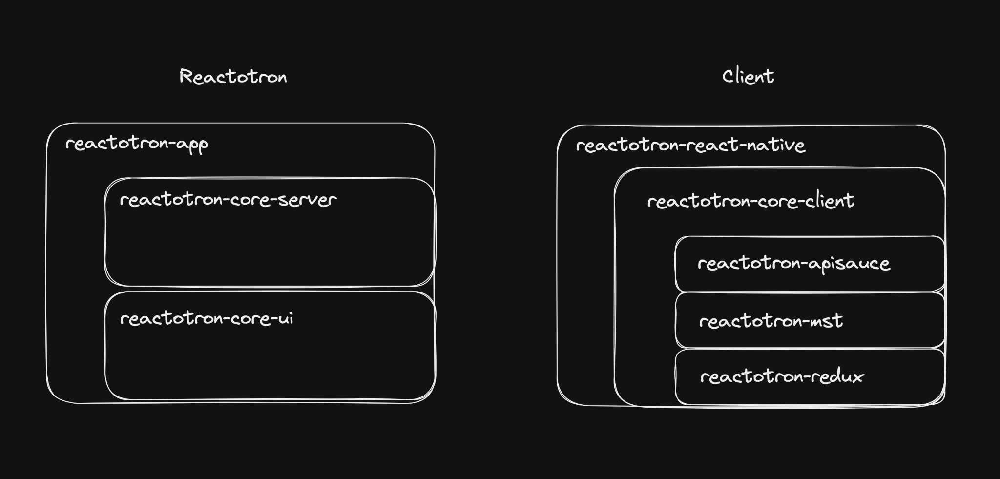

# Architecture

## Publish / Subscribe

Reactotron uses a publish / subscribe model to communicate between clients. This is implemented using WebSockets.

There are three main parties:

1. The web socket server that publishes information
2. The Electron app with Reactotron's UI, which subscribes to app updates
3. The app client that we are debugging, which sends commands with information about the app to the server

Websockets are used to sends "commands", which are JSON objects with information about the app we are debugging. The payloads are sent to the server, which then publishes them to all subscribers (like the Electron app).

## Workspaces

This repository is broken into different workspaces:

### Reactotron app

These workspaces are used to build the Electron app that runs Reactotron.

- `reactotron-app` - The Electron app that runs Reactotron.
- `reactotron-core-ui` - UI components used by Reactotron. This was created to allow for other types of Reactotron clients to be built.
- `reactotron-core-server` - The server that receives commands from the client and publishes them to subscribers. This server is started when the Reactotron Electron app is started.

### Reactotron client

Clients are based around a plugin architecture. This allows us to add new features without having to modify the core of Reactotron.

See [reactotron-core-client](https://github.com/infinitered/reactotron/tree/main/lib/reactotron-core-client) for more information about plugins are implemented. In short, plugins are a way to listen to all the commands published by the server and then can do certain actions or publish new commands.

These workspaces are used to build the client that we are debugging.

#### Core Plugins

- `reactotron-core-client` - The base client with functionality for sending commands to the server.
- `reactotron-react-native` - This is the Reactotron client for React Native apps. This contains core plugins specific to React Native apps.
- `reactotron-react-js` - This is the Reactotron client for React web apps. This contains core plugins specific to React web apps.

#### Extra Plugins

Reactotron client is built on a plugin architecture. This allows us to add new features without having to modify the core of Reactotron.

- `reactotron-redux` - This is a plugin that adds Redux support to Reactotron.
- `reactotron-mst` - This is a plugin that adds MobX State Tree support to Reactotron.
