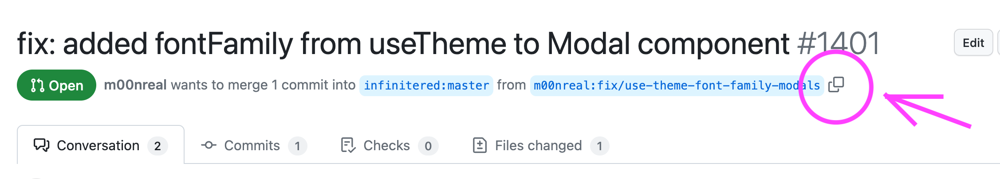
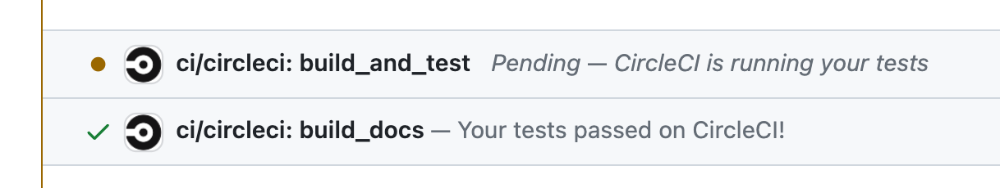

# Running CI Scripts on Untrusted Forks

Untrusted forks could contain malicious code to mine cryptocurrency, steal secrets, or otherwise harm the CI server. 

For PRs from untrusted forks, to run the CI scripts, we need to:

1. Review the code to ensure that it is safe to run on the CI server.
2. If the code is safe, run the `ci:trust` script to push the commits to a branch on the main repository, where the CI scripts can be run.
3. Once the tests have run, the status of the PR will be updated automatically (because the commits are the same).


## How to run the CI scripts on untrusted forks:

1. Copy the name of the branch from the PR.
   
2. From your local clone of the main repository, run the `ci:trust` script.
    ```bash
    yarn ci:trust <branch-name>
    ```
3. The branch will be pushed and the tests will run
   


## What does ci:trust do?

The `ci:trust` script does the following:

1. Adds and fetches the untrusted fork as a temporary remote in your local repository.
2. Pushes the specific branch from the untrusted fork to a designated temporary branch in your original repository. 
3. Pushing to a local branch triggers the continuous integration (CI) tests on the commits of the branch.
4. Because the commits are the same, the status of the PR will be updated automatically.


### Notes
1. The ci:trust script will only work if you have write access to the main repository. This prevents malicious users from running the script on the main repository.
2. The ci:trust script pushes the commits to a branch called `temp-branch-to-test-fork`.

::: warning

The `temp-branch-to-test-fork` branch will be deleted and recreated if it already exists. This allows the script to
clean up its own temporary branches.  

:::
