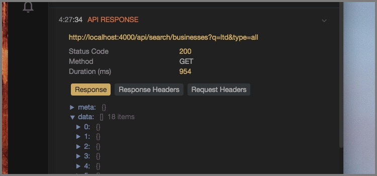

# reactotron-apisauce

[Apisauce](http://github.com/skellock/apisauce) is a lightweight wrapper around the fantastic [Axios](https://github.com/mzabriskie/axios) networking library.



# Installing

`npm i --save-dev reactotron-apisauce`


# Configuring

In the place where you setup your reactotron configuration, you import `reactotron-apisauce` plugin and throw it at Reactotron.

```js
import apisaucePlugin from 'reactotron-apisauce'  // <--- import

// then plug it in when you configure Reactotron.

Reactotron
  .configure()
  .use(apisaucePlugin()) // <-- here we go!!!
  .connect()
```

Next, wherever you create your api for you application, bring in Reactotron and attach the monitor to your apisauce instance.

```js
import Reactotron from 'reactotron-react-js'
// import Reactotron from 'reactotron-react-native' // or use this for mobile

// Apisauce has a feature where you can attach a handler to watch
// all requests/response flowing through your api.  You can hook this up:
api.addMonitor(Reactotron.apisauce)

// or ...

// if you just wanted to track on 500's
api.addMonitor(response => {
  if (response.problem === 'SERVER_ERROR')
    Reactotron.apisauce(response)
})
```
