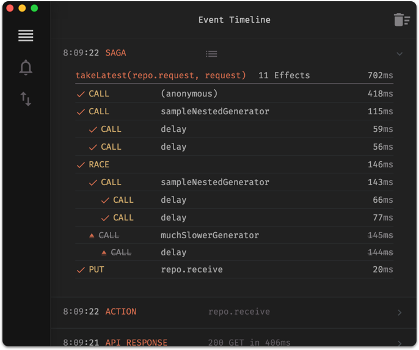
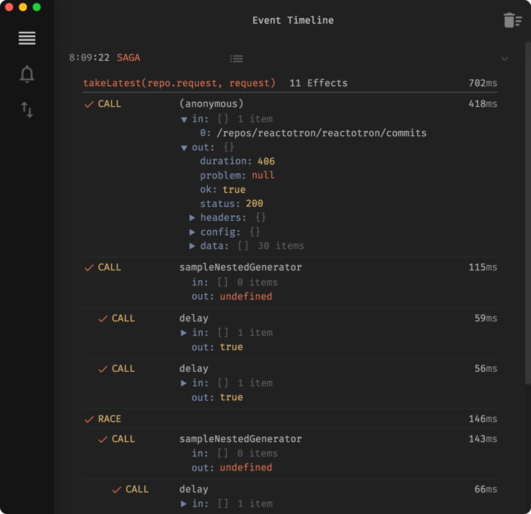

# reactotron-redux-saga

[Redux Saga](https://github.com/yelouafi/redux-saga) is a side effect management package for Redux.

When you run through a saga in your app, you'll be able to see the both the saga and how the effects that it triggers along the way.

In simple mode (default), it shows 1 line per effect.



In detailed mode, you can see the inputs and outputs of each action.



# Installing

`reactotron-redux-saga` is a Reactotron plugin which lives in its own npm package.

```
npm install --save-dev reactotron-redux-saga
```

# Configuration

#### Step 1 - Plugin to Reactotron

In your `ReactotronConfig.js` file you will import the plugin and use it with Reactotron.

```js
import sagaPlugin from "reactotron-redux-saga"

// then add it to the plugin list
Reactotron.configure().use(sagaPlugin()) // <-- sweet
```

#### Step 2 - Plugin to Redux Saga

Wherever you create your Redux store, you'll have a line configured for configuring your `redux-saga` middlware.

```js
import Reactotron from "reactotron-react-native"
// or from 'reactotron-react-js'

// create our new saga monitor
const sagaMonitor = Reactotron.createSagaMonitor()

// and in your call to createSagaMiddlware, pass it along inside
// the 1st parameter's object.
const sagaMiddleware = createSagaMiddleware({ sagaMonitor })
```

That's it.

# Implementation Notes

Currently (as of 1.4.0 of Reactotron), sagas must be launched via a fork. That means, if you're using `takeLatest` and/or `takeEvery`, then you're good to go.

This is a very [common and populate pattern](`https://github.com/yelouafi/redux-saga#sagasjs`) in the latest version of `redux-saga`. That's `0.12` as of this writing.

Your root saga will end up looking something like this:

```js
// these sagas always accept an action
function* move(action) {
  const { direction } = action
  // do interesting things
}

// they're always the last parameter
function* jump(action) {}

// see?
function* search(api, action) {}

// this would be the saga that you run from your middlware to kick everything off
function* rootSaga() {
  yield [
    takeLatest("MOVE", move), // actions are implicitly passed
    takeLatest("JUMP", jump), // even if you don't want them
    takeEvery("SEARCH", search, api), // here we're passing a custom param
  ]
}
```

# What Do You Think?

This feature is fairly new.

I'd love to hear more about what you'd like to see in monitor tracking. [File an issue](https://github.com/reactotron/reactotron/issues) with what's on your mind.
