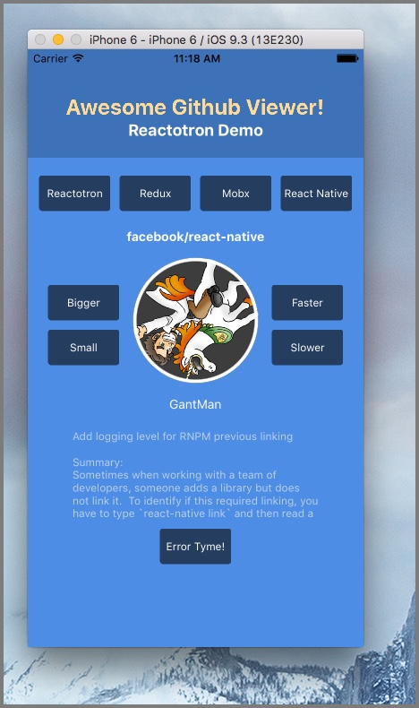

## Reactotron Functions

Let's explore some classic functions available with Reactotron.

Add to your `App.js` (Create React Native App) or `index.js` file

```js
import Reactotron from "reactotron-react-native";
```

#### Log

```js
Reactotron.log("hello rendering world");
```

Now Reactotron looks like this:


While collapsed, the grey arrow to the right shows a preview. Click to open.


Now, let's change our log statement and try different methods.

```js
Reactotron.log({
  numbers: [1, 2, 3],
  boolean: false,
  nested: { here: "we go" },
});
```

#### Warn

```js
Reactotron.warn("*glares*");
```

#### Error

```js
Reactotron.error("Now you've done it.");
```

#### Display

```js
Reactotron.display({
  name: "KNOCK KNOCK",
  preview: "Who's there?",
  value: "Orange.",
});

Reactotron.display({
  name: "ORANGE",
  preview: "Who?",
  value: "Orange you glad you don't know me in real life?",
  important: true,
});
```

<!--
## Monitor your Redux store state changes

Hooking up to redux requires some [additional set up](https://github.com/infinitered/reactotron/blob/master/docs/plugin-redux.md).

## Now What?

Well, at this point, we have a complicated version of `console.log`.

Where Reactotron starts to shine is when you start plugging into [Redux](./plugin-redux.md), tracking global errors, and watching network requests.

Check out our [Demo](../examples/demo-react-native) for more goodies.



 -->
