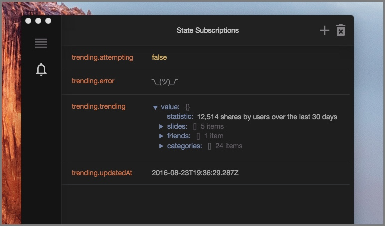

# reactotron-redux

[Redux](http://redux.js.org/) is library for managing global state.  It's pretty damn awesome.

And everyone knows when you combine two great things, you get a super-awesome thing.  Except for toothpaste & orange juice.  Keep those separate.





# Installing

`reactotron-redux` is a plugin which lives in a different npm package.  You can install it by typing:

```
npm install --save-dev reactotron-redux
```

# Features

* track when actions are dispatch including timing
* subscribe to changes within the state tree
* pull values out on demand
* view list of keys
* dispatch actions from Reactotron

# Setting Up

This plugin connects Reactotron to Redux via Redux's [Store Enhancer](http://redux.js.org/docs/Glossary.html#store-enhancer) plugin system.

You'll configure where you setup your Redux store.  In that file, we'll import both `reactotron-redux` and Reactotron.

```js
import Reactotron from 'reactotron-react-js'
// import Reactotron from 'reactotron-react-native'  // if on mobile
import { createReactotronStoreEnhancer } from 'reactotron-redux'
```

`createReactotronEnhancer` is a function that creates an enhancer ready to inject into Redux. There are 2 parameters.

1. `reactotronInstance` (required) - `Reactotron` itself. It's the object that came out of the import at the top.
2. `options` (optional) - An object providing configuration option to the store enhancer.

Use take the return value and put that into your call to `createStore()`.

**IMPORTANT:  Your enhancer should go first if there are multiple enhancers.**

Here's a few examples in action:

```js
const reactotronEnhancer = createReactotronStoreEnhancer(Reactotron)

// where there are no other enhancers
createStore(rootReducer, reactotronEnhancer)

// using Redux's compose() to bring together multiple enhancers
createStore(rootReducer, compose(reactotronEnhancer, applyMiddleware(logger, sagaMiddleware)))
```

See the demos for more examples.

# Options

`createReactotronStoreEnhancer` supports options as the 2nd parameter.

`except` is an array of strings that match actions flowing through Redux.

If you have some actions you'd rather just not see (for example, `redux-saga`)
triggers a little bit of noise, you can suppress them:

```js
createReactotronEnhancer(Reactotron, {
  except: ['EFFECT_TRIGGERED', 'EFFECT_RESOLVED', 'EFFECT_REJECTED']
})
```

`isActionImportant` is a way to mark certain actions as "important".   Important messages are display in a bolder style that gets your attention within Reactotron.  

It is a function that accepts the action and returns a `boolean`.  `true` is important.  `false` is normal.

```js
createReactotronEnhancer(Reactotron, {
  isActionImportant: action => action.type === 'FORMAT_HARD_DRIVE'
})
```

# State Snapshots (Time Travel)

Also supported is the ability to take snapshot of the whole state and upload them to the application later.

To do this, you create another reducer to wrap your own root reducer.  Like this:

```js
// grab your reducers as usual
import rootReducer from '../Reducers' // or wherever your reducers live

// import createReplacementReducer as well
import { createReactotronStoreEnhancer, createReplacementReducer } from 'reactotron-redux'

// pass in your reducer to create a new reducer
const oneReducerToRuleThemAll = createReplacementReducer(rootReducer)

//  then hand that off to the store (as usual)
```

Congrats!  Now you can upload & download state from inside the Reactotron App.
