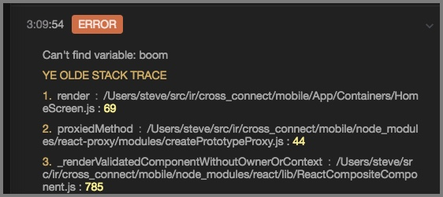

# Track Global Errors

Both `reactotron-react-native` and `reactotron-react-js` ship with a plugin called `trackGlobalErrors`.

The goal of this plugin is to ensure all error will get thrown over to Reactotron for display.




# Usage

Where you setup your Reactotron in your app, you also require the additional plugin.

```js
import Reactotron, { trackGlobalErrors } from 'reactotron-react-native'`
```

or

```js
import Reactotron, { trackGlobalErrors } from 'reactotron-react-js'
```

Next, we add it as a plugin to Reactotron.

```js
Reactotron
  .configure()
  .use(trackGlobalErrors()) // <--- here we go!
  .connect()
```

One option that `trackGlobalErrors()` supports is `veto`.  Veto is function that allows you to some frames you would like to leave out of the stack trace passed along.

For example, on React Native, perhaps you'd like to leave off any frames sourced from React Native itself?

```js
Reactotron
  .configure()
  .use(trackGlobalErrors({
    veto: frame => frame.fileName.indexOf('/node_modules/react-native/') >= 0
   }))
  .connect()
```

`veto` is a function that takes an `object` and returns a `boolean`.  True = ditch it.  False = keep it.

```
functionName:  the name of the function or null if an anonymous function
lineNumber:    the line number of the error
columnNumber:  the column number of the error
fileName:      the name of the file
```

### React JS Source Maps

Source maps for projects in webpack need to have the `devtool` set to `source-map`.  On `create-react-app`-based apps, they use `eval`, so this will not work.  You will have to switch your development webpack to support this.

For ReactJS you have the option to not do source-map lookups, but still pass errors along by going into offline mode.

```js
Reactotron
  .configure()
  .use(trackGlobalErrors({
    offline: true
  }))
  .connect()
```


# How It Works Internally

### React JS
It hijacks the browser's `window.onerror` event, immediately calling the previous `onerror`, then attempts to resolve the source of the errors via a source-map lookup.  If successful, it throws a message over to Reactotron.


### React Native
On React Native, it hooks `NativeModules.ExceptionsManager.updateExceptionMessage`.  This is a message that occurs after the source map lookup for React Native.  It always calls the original function so it won't break anything internally.  Your Red Box will still show.

Because we're hooking a Facebook internal function, this is a bit fragile.  I'll stay on top of any React Native upgrades that might cause problems should the API change.
