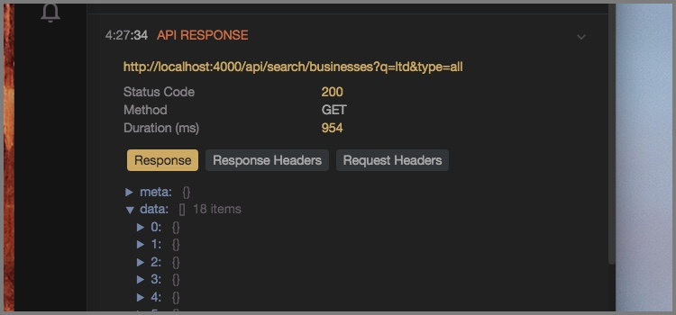

# reactotron-apisauce

[Apisauce](http://github.com/skellock/apisauce) is a lightweight wrapper around the fantastic [Axios](https://github.com/mzabriskie/axios) networking library.



## Installing

```
npm i --save-dev reactotron-apisauce
```

```
yarn add reactotron-apisauce -D
```

## Configuration

To use the apisauce plugin, add the additional plugin on the `import` line.

```js
import apisaucePlugin from "reactotron-apisauce" //
```

Then plug it in when you configure Reactotron.

```js
Reactotron.configure()
  .use(
    apisaucePlugin({
      // ignoreContentTypes: /^(image)\/.\*$/i // <--- a way to skip printing the body of some requests (default is any image)
    })
  ) // <-- here we go!!!
  .connect()
```

## Usage

Next, wherever you create api functions for you application, bring in Reactotron and attach the monitor to your apisauce instance. Apisauce has a feature where you can attach a handler to watch.

1. To view all requests/response flowing through your api

```js
//for web
import Reactotron from "reactotron-react-js"

//for mobile
import Reactotron from "reactotron-react-native"

api.addMonitor(Reactotron.apisauce)
```

2. To view only the requests/response that have a problem

```js
//if you just wanted to track on 500's
api.addMonitor((response) => {
  if (response.problem === "SERVER_ERROR") Reactotron.apisauce(response)
})
```
