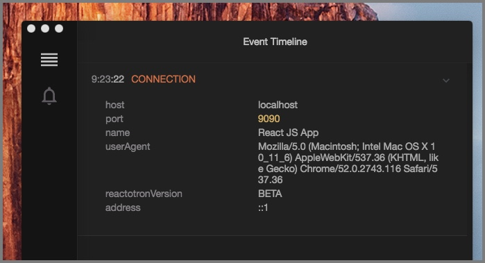
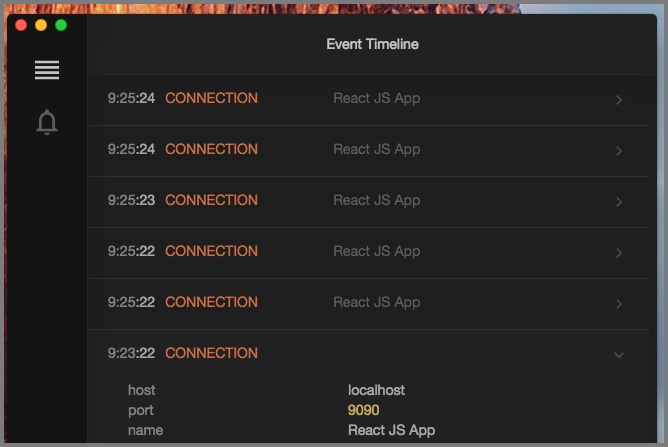
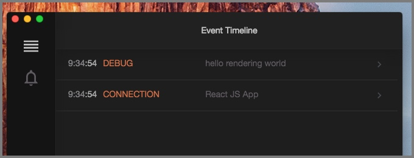
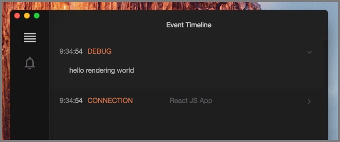
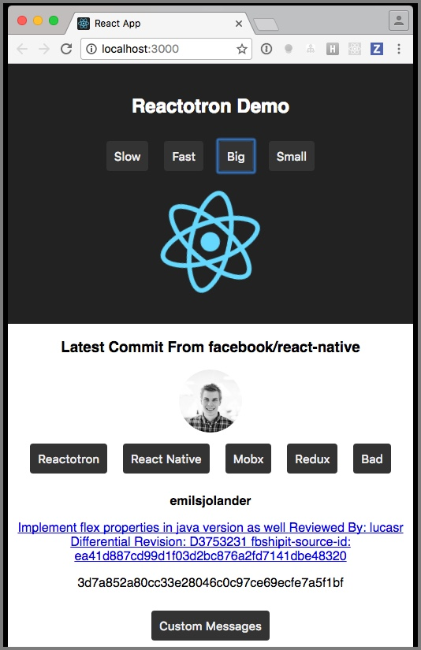
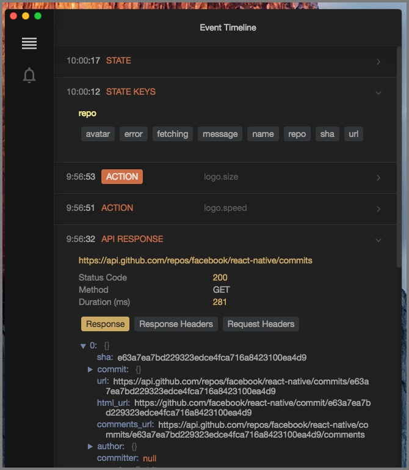

# Quick Start for React JS

## Installing Reactotron.app

Let’s [download the desktop app](https://github.com/reactotron/reactotron/releases) to start. You can download for Linux, Windows, and Mac.

Unzip & run.


## Humble Beginnings

Did you B.Y.O.App?  Skip to the next section.

Let’s use [create-react-app](https://github.com/facebookincubator/create-react-app) to bootstrap a new React JS app because, wow, is it fantastic.

Download `create-react-app` if you haven't yet:
```
npm i -g create-react-app
```

Then spin up a brand new React web app.
```
create-react-app this-better-work
cd this-better-work
```

## Installing Reactotron

Let's install Reactotron as a dev dependency.

```
npm i --save-dev reactotron-react-js
```

I like a separate file for initializing.  Create `src/ReactotronConfig.js` in your editor of choice and paste this:

```js
import Reactotron from 'reactotron-react-js'

Reactotron
  .configure() // we can use plugins here -- more on this later
  .connect() // let's connect!
```

Finally, we import this on startup in `src/index.js` on line 1:

```js
import './ReactotronConfig'
```

At this point, Reactotron is hooked up.

Refresh your web page (or start it up `npm start`) and have a look at Reactotron now.  Do you see the `CONNECTION` line?  Click that to expand.




Go back to your web page and refresh the web page 5 or 6 times.  Now look.



Pretty underwhelming huh?


## Hello World

Let's do some classic programming.

Open up `src/App.js`.

At the top, let's put

```js
import Reactotron from 'reactotron-react-js'
```

Next, inside the `render()` function, put this as the first line:

```js
Reactotron.log('hello rendering world')
```

Save that file and refresh your web page if you don't have live reloading.

Now Reactotron looks like this:



While collapsed, the grey area to the right shows a preview.  Click to open.



Let's change our log statement to:

```js
Reactotron.log({ numbers: [1, 2, 3], boolean: false, nested: { here: 'we go' } })
```

Or this

```js
Reactotron.warn('*glares*')
```

Or this

```js
Reactotron.error('Now you\'ve done it.')
```

Or this

```js
Reactotron.display({
  name: 'KNOCK KNOCK',
  preview: 'Who\'s there?',
  value: 'Orange.'
})

Reactotron.display({
  name: 'ORANGE',
  preview: 'Who?',
  value: 'Orange you glad you don\'t know me in real life?',
  important: true
})
```

## Monitor your Redux store state changes

Hooking up to redux requires some [additional set up](https://github.com/infinitered/reactotron/blob/master/docs/plugin-redux.md).

## Now What?

Well, at this point, we have a complicated version of `console.log`.

Where Reactotron starts to shine is when you start plugging into [Redux](https://github.com/infinitered/reactotron/blob/master/docs/plugin-redux.md), tracking global errors, and watching network requests.

Check out our [Demo](../examples/demo-react-js) for more goodies.




