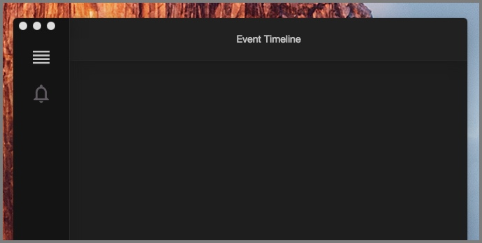
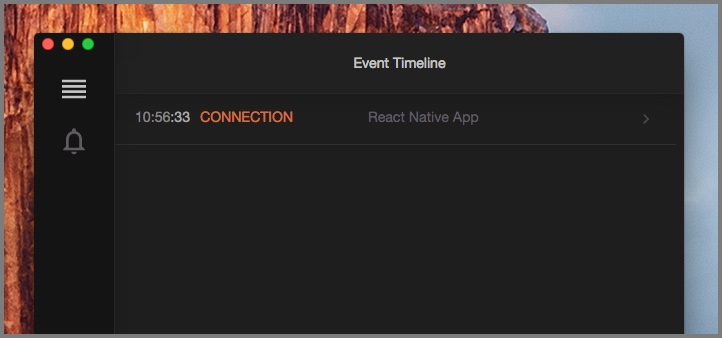
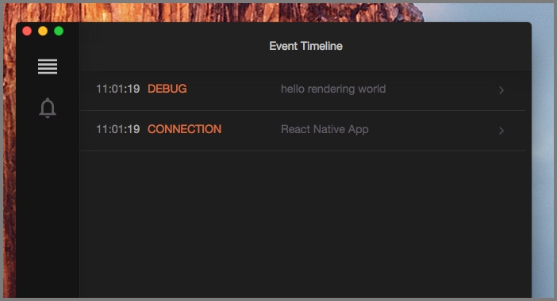
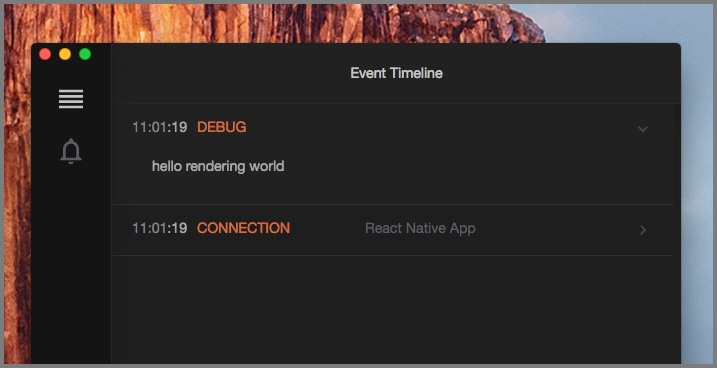
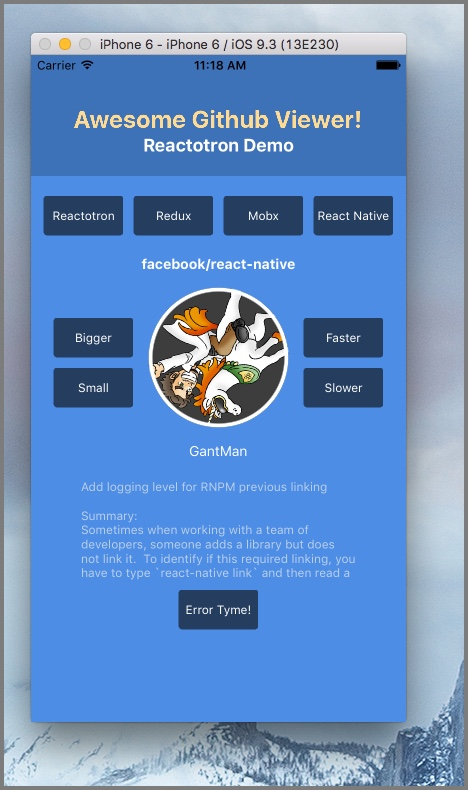

# Quick Start for React Native

## Installing Reactotron.app

Let’s [download the desktop app](./installing.md) to start.  You can download for Linux, Windows, and Mac.

Unzip & run.



## Configure Reactotron with your project

Let's install Reactotron on your project as a dev dependency. Don't have a React Native project yet? [Follow the Getting Started guide in the React Native documentation](https://facebook.github.io/react-native/docs/getting-started.html).

```
npm i --save-dev reactotron-react-native
```

I like a separate file for initializing.  Create `ReactotronConfig.js` in your editor of choice and paste this:

```js
import Reactotron from 'reactotron-react-native'

Reactotron
  .configure() // controls connection & communication settings
  .useReactNative() // add all built-in react native plugins
  .connect() // let's connect!
```

Or using a more advanced way to customize which plugins to include:

```js
import Reactotron, {
  trackGlobalErrors,
  openInEditor,
  overlay,
  asyncStorage,
  networking
} from 'reactotron-react-native'

  Reactotron
    .configure({
      name: 'React Native Demo'
    })
    .use(trackGlobalErrors())
    .use(openInEditor())
    .use(overlay())
    .use(asyncStorage())
    .use(networking())
    .connect()
```

Finally, we import this on startup in `App.js` (Create React Native App) or `index.ios.js` and `index.android.js` (react-native-cli) on line 1:

```js
import './ReactotronConfig'
```

At this point, Reactotron is hooked up.

Refresh your app (or start it up `react-native start`) and have a look at Reactotron now.  Do you see the `CONNECTION` line?  Click that to expand.




Go back to your app and refresh it 5 or 6 times.  Now look.


Pretty underwhelming huh?


## Hello World

Let's do some classic programming.

Open up `App.js` (Create React Native App) or `index.ios.js` / `index.android.js` (react-native-cli).

Right after the line you just added in the previous step lets put this:

```js
import Reactotron from 'reactotron-react-native'
```

Next, inside the `render()` function, put this as the first line:

```js
Reactotron.log('hello rendering world')
```

Save that file and refresh your app if you don't have live reloading.

Now Reactotron looks like this:



While collapsed, the grey area to the right shows a preview.  Click to open.



Let's change our log statement to:

```js
Reactotron.log({ numbers: [1, 2, 3], boolean: false, nested: { here: 'we go' } })
```

Or this

```js
Reactotron.warn('*glares*')
```

Or this

```js
Reactotron.error('Now you\'ve done it.')
```

Or this

```js
Reactotron.display({
  name: 'KNOCK KNOCK',
  preview: 'Who\'s there?',
  value: 'Orange.'
})

Reactotron.display({
  name: 'ORANGE',
  preview: 'Who?',
  value: 'Orange you glad you don\'t know me in real life?',
  important: true
})
```

## Monitor your Redux store state changes

Hooking up to redux requires some [additional set up](https://github.com/infinitered/reactotron/blob/master/docs/plugin-redux.md).

## Now What?

Well, at this point, we have a complicated version of `console.log`.

Where Reactotron starts to shine is when you start plugging into [Redux](./plugin-redux.md), tracking global errors, and watching network requests.

Check out our [Demo](../packages/demo-react-native) for more goodies.




