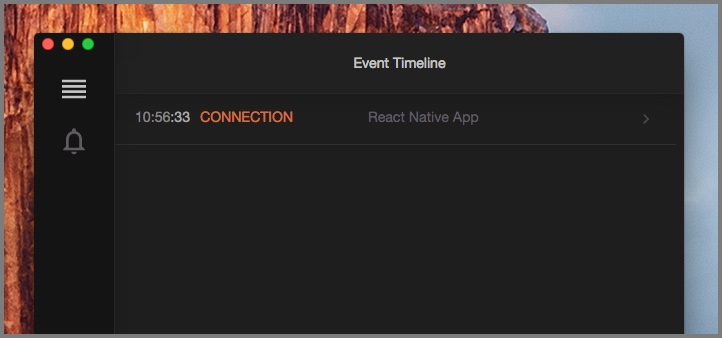

# Quick Start for Expo targeting Web and Native

To run Reactotron in an Expo app where you target both web and native platforms, you need to combine the "react-js" and "react-native" setup, and leverage the platform file extensions to load the right config for the current platform.

If you are only targeting native platforms, or only targeting the web platform, you can use the [react-native](./react-native.md) or [react-js](./react-js.md) guides respectively.

## Installing Reactotron.app

Let’s [download the desktop app](https://github.com/infinitered/reactotron/releases?q=reactotron-app&expanded=true) to start. You can download for Linux, Windows, and Mac.

Unzip & run.


## Configure Reactotron with your project

#### **Step 1 - Add Reactotron as DEV dependency**

Add Reactotron, in both react-native and react-js flavors, in your Expo project as a dev dependency.

```
npm i --save-dev reactotron-react-native reactotron-react-js
```

```
yarn add reactotron-react-native reactotron-react-js -D
```

#### **Step 2 - Initialization**

Create a file in your root folder `ReactotronConfig.native.js` and paste this:

```js
import Reactotron from "reactotron-react-native";

Reactotron.configure() // controls connection & communication settings
  .useReactNative() // add all built-in react native plugins
  .connect(); // let's connect!
```

See the [react-native page](./react-native.md) if you want to customize Reactotron for React-native further.

Then create another file in your root folder named `ReactotronConfig.web.js` and paste this:

```js
import Reactotron from "reactotron-react-js"

Reactotron.configure() // we can use plugins here
  .connect() // let's connect!
```

#### **Step 3 - Add Reactotron to your app**

Finally, we import the configuration in the `app/_layout.js` file which is the lowest-level file that Expo Router gives us access to.

After the imports:

```js
if (__DEV__) {
  require("../ReactotronConfig"); // Or "../../ReactotronConfig" if you use a /src folder.
}
```

Expo will load either the native or the web flavor of ReactotronConfig based on the platform it is running in. At this point, Reactotron is hooked up. **HOUSTON, WE HAVE A CONNECTION!**

Refresh your app (or start it up with `expo start`) and have a look at Reactotron now. Do you see the `CONNECTION` line? Click that to expand.



Go back to your app and refresh it 5 or 6 times. Now look.


## Troubleshooting

**Android**: If you are using an Android device or an emulator run the following command to make sure it can connect to Reactotron:

```
adb reverse tcp:9090 tcp:9090
```
