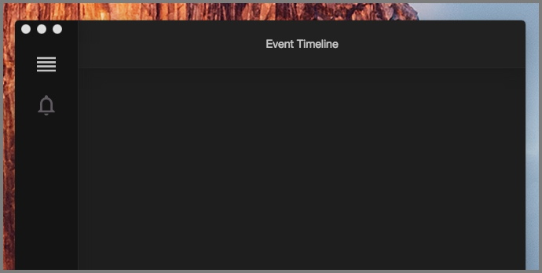
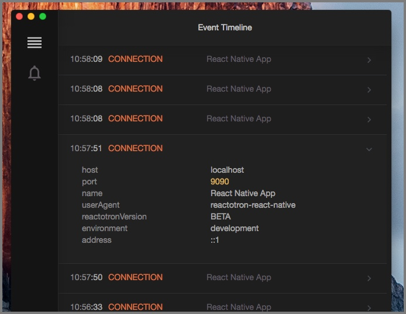

# Quick Start for React Native

## Installing Reactotron.app

Let’s [download the desktop app](https://github.com/infinitered/reactotron/releases?q=reactotron-app&expanded=true) to start. You can download for Linux, Windows, and Mac.

Unzip & run.



## Configure Reactotron with your project

#### **Step 1 - Add Reactotron as DEV dependency**

Add Reactotron on your React Native project as a dev dependency.

```
npm i --save-dev reactotron-react-native
```

```
yarn add reactotron-react-native -D
```

#### **Step 2 - Initialization**

Create a file in your root folder `ReactotronConfig.js` and paste this:

```js
import Reactotron from "reactotron-react-native";
import { AsyncStorage } from "@react-native-async-storage/async-storage";

Reactotron.setAsyncStorageHandler(AsyncStorage)
  .configure() // controls connection & communication settings
  .useReactNative() // add all built-in react native plugins
  .connect(); // let's connect!
```

Or using a more advanced way to customize which plugins to include:

```js
import Reactotron from "reactotron-react-native";
import { AsyncStorage } from "@react-native-async-storage/async-storage";

Reactotron.setAsyncStorageHandler(AsyncStorage)
  .configure({
    name: "React Native Demo",
  })
  .useReactNative({
    asyncStorage: false, // there are more options to the async storage.
    networking: {
      // optionally, you can turn it off with false.
      ignoreUrls: /symbolicate/,
    },
    editor: false, // there are more options to editor
    errors: { veto: (stackFrame) => false }, // or turn it off with false
    overlay: false, // just turning off overlay
  })
  .connect();
```

Alternatively, you can create your own plugin and provide it via:

```js
import Reactotron from "reactotron-react-native";

const middleware = (tron) => {
  /* plugin definition */
};

Reactotron.setAsyncStorageHandler(AsyncStorage)
  .configure({
    name: "React Native Demo",
  })
  .useReactNative() // add all built-in react native plugins
  .use(middleware) // plus some custom made plugin.
  .connect();
```

If you're using Expo, you will also need to configure the host:

```js
import Reactotron from "reactotron-react-native";
import { NativeModules } from "react-native";
import { AsyncStorage } from "@react-native-async-storage/async-storage";

const hostname = NativeModules.SourceCode.scriptURL
  .split("://")[1] // Remove the scheme
  .split("/")[0] // Remove the path
  .split(":")[0]; // Remove the port

Reactotron.setAsyncStorageHandler(AsyncStorage)
  .configure({ host: hostname }) // configure the hostname for Expo
  .useReactNative() // add all built-in react native plugins
  .connect(); // let's connect!
```

#### **Step 3 - Add Reactotron to your app**

Finally, we import this on in one of:

- `App.js` (Create React Native App / Expo) or
- `index.js`

on line 1:

```js
if (__DEV__) {
  import("./ReactotronConfig").then(() => console.log("Reactotron Configured"));
}
```

At this point, Reactotron is hooked up. **HOUSTON, WE HAVE A CONNECTION!**

Refresh your app (or start it up `react-native start`) and have a look at Reactotron now. Do you see the `CONNECTION` line? Click that to expand.


Go back to your app and refresh it 5 or 6 times. Now look.



## Troubleshooting

**Android**: If you are using an Android device or an emulator run the following command to make sure it can connect to Reactotron:

```
adb reverse tcp:9090 tcp:9090
```
