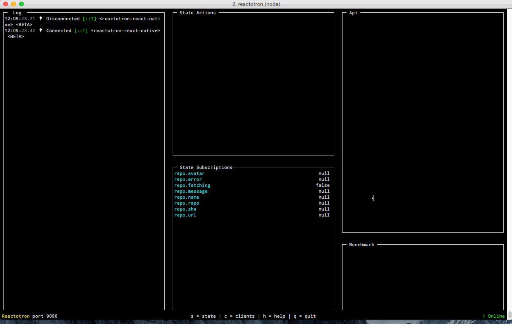

#  Reactotron

[](https://gitter.im/reactotron/reactotron?utm_source=badge&utm_medium=badge&utm_campaign=pr-badge&utm_content=badge)

A CLI and OS X app for inspecting your [React JS](https://facebook.github.io/react/) and [React Native](https://facebook.github.io/react-native/) apps.

# Download

[Download OS X App](https://github.com/reactotron/reactotron/releases/download/v1.0.0/Reactotron.app.zip) from GitHub...

Or Install CLI with:

```
npm install -g reactotron-cli
```


# About

Use it to:

* view your application state
* show API requests & responses
* perform quick performance benchmarks
* subscribe to parts of your application state
* display messages similar to console.log
* track global errors with source-mapped stack traces
* dispatch actions like a government-run mind control experiment

You plug it into your app as a dev dependency so it adds nothing to your product builds.

The app comes in two forms:

### Desktop

Reactotron on the left, demo React Native app on the right.


### Command Line




Welcome to flavour country.

# Quick Start

* See the [React JS Quick Start](docs/quick-start-react-js.md).
* See the [React Native Quick Start](docs/quick-start-react-native.md).

# Usage

* [Track Errors](docs/plugin-track-global-errors.md)
* Integrate with [Redux](docs/plugin-redux.md)
* Networking monitoring with [Apisauce](docs/plugin-apisauce.md)
* Start making fetch happen (plugin coming soon...)
* Creating Your Own Plugins (tutorial coming soon...)
* The JSON interface between client & server (coming soon...)


# Special Thanks

Reactotron is sponsored by [Infinite Red](https://infinite.red) who encourage this type of open-source hacking & sharing.  They specialize in React, React Native, and Elixir. <3

[](https://infinite.red)

# Change Log

* August 23rd, 2016 - [1.0.1](https://github.com/reactotron/reactotron/releases/tag/v1.0.1)
* August 23rd, 2016 - [1.0.0](https://github.com/reactotron/reactotron/releases/tag/v1.0.0)
* August 21st, 2016 - [0.94.0](https://github.com/reactotron/reactotron/releases/tag/v0.94.0)
* August 18th, 2016 - [0.93.0](https://github.com/reactotron/reactotron/releases/tag/v0.93.0)
* August 16th, 2016 - [0.92.0](https://github.com/reactotron/reactotron/releases/tag/v0.92.0)
* August 9th, 2016 - [0.9.0](https://github.com/reactotron/reactotron/releases/tag/v0.9.0)
* July 29th, 2016 - [0.8.0](https://github.com/reactotron/reactotron/releases/tag/v0.8.0)
* July 15th, 2016 - [0.7.0](https://github.com/reactotron/reactotron/releases/tag/v0.7.0)
* April 27th, 2016 - [0.6.1](https://github.com/reactotron/reactotron/releases/tag/v0.6.1)
* April 24th, 2016 - [0.6.0](https://github.com/reactotron/reactotron/releases/tag/v0.6.0)
* April 23rd, 2016 - [0.5.0](https://github.com/reactotron/reactotron/releases/tag/v0.5.0)
* April 23rd, 2016 - [0.4.0](https://github.com/reactotron/reactotron/releases/tag/v0.4.0)
* April 22nd, 2016 - [0.3.0](https://github.com/reactotron/reactotron/releases/tag/v0.3.0)
* April 21st, 2016 - [0.2.0](https://github.com/reactotron/reactotron/releases/tag/v0.2.0)
* April 20th, 2016 - [0.2.0](https://github.com/reactotron/reactotron/releases/tag/v0.1.0)
